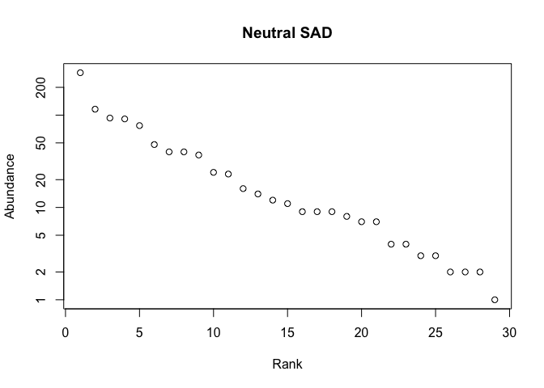
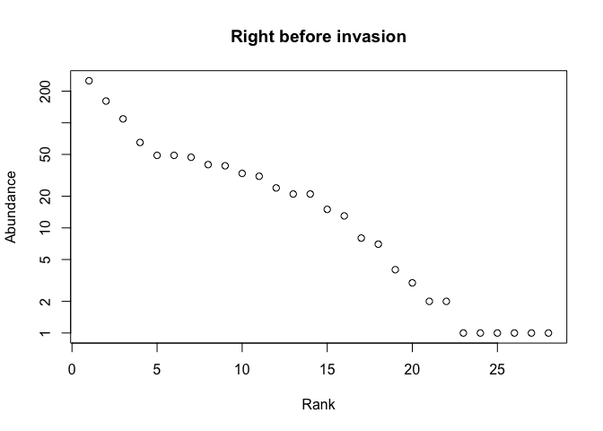
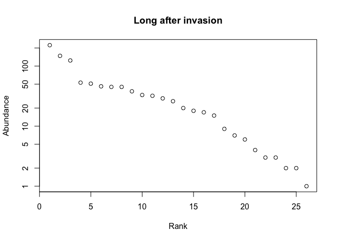

SIMULATING BIODIVERSITY PATTERNS: NEUTRAL, COMPETITIVE & INVASION MODELS
================
Phoebe Jekielek and Sarah Risley            

Fall, 2022

**Introduction**

Hubbell’s neutral theory of biodiversity and biogeography highlights the
importance of unifying ecological processes–birth, death, and
immigration–and offers a null model that can provide insight into
current and future species-abundance distributions. Neutral theory is
commonly used in ecology to describe and understand biodiversity and
evolution patterns, and although its applications are expanding, it
primarily supports theoretical exploration (Rosindell et al., 2011).
Although neutral theory had been applied in the marine context (see
Alzate et al., 2019, Dolan et al., 2007, Wootton, 2005, among others),
it is not commonly used in marine ecosystems or for species that are
targeted by marine fisheries.

Biodiversity indices have been developed over the years to help us
compare and measure biodiversity across scales, taxa, trophic levels or
regions. Species richness is perhaps the simplest of the diversity
metrics, representing the total number of species represented in a
population without taking species abundance or relative abundance into
consideration (Whittaker, 1972). Both the Shannon-Weiner index (Shannon
and Weaver, 1949) and the Simpson’s Index take into account species
richness and abundance distribution of a species. The Shannon-Weiner
index measures the amount of uncertainty of picking the same species
twice from a random draw from all of the species in a community.
Therefore, a high level of uncertainty indicates a higher species
diversity. The Simpson’s Index measures probability that two individuals
randomly sampled belong to different species. Again, the higher the
Simpson index, the higher the diversity.

In this study, we seek to explore how neutral theory can be used to
understand biodiversity patterns in intertidal marine ecosystems, with a
focus on commercially important shellfish species. Using classical
biodiversity indices, will compare the neutral theory model to a
competitive model and assess how well each model represents biodiversity
patterns in a marine ecosystem. Specifically, we will model the
biodiversity patterns that occur under immigration pulses from rare
species. This approach aims to model recent species introductions
observed in many of Maine’s intertidal marine ecosystems, namely the
introduction of wild American oysters and increases in invasive green
crab populations. This study will inform future analyses and help to
identify potential forces driving biodiversity patterns in these
systems.

**Study System**

The Damariscotta River estuary, located in midcoast Maine, hosts a
diversity of coastal marine habitats ranging from rocky shores to soft
sediment intertidal areas and eelgrass beds. The estuary is home to
extensive human activity, including recreational boating, commercial
fishing, and shellfish aquaculture. The Damariscotta has more than a
dozen marine aquaculture operations that total 0.93 km², where farmers
grow American oysters, mussels, scallops, and kelp (Maine DMR, 2022).
The biodiversity in the Damariscotta is similar to other estuaries in
the Gulf of Maine and varies along habitat type and physical and
biological gradients (Britsch, 2021).

The intertidal mudflat is the focus of this study. This habitat hosts a
diversity of shellfish, marine worm, and arthropod species. Of
commercial interest are soft-shell clams (*Mya arenara*), quahogs
(*Mercenaria mercenaria*), razor clams (*Ensis directus*), blood worms
(*Glycera dibranchiata*), and sand worms (*Nereis virens*). Within the
past 20 years commercial shellfish harvesters have observed the
appearance of wild American oyster (*Crassostrea virginica*), a
previously extirpated species now reappearing ostensibly as a result of
aquaculture activity (Delago, 2021; Risley, 2022). Green crabs
(*Carcinus maenas*), an invasive species originally from the
Mediterranean, have also experienced a recent growth in population
abundance, likely linked to warming ocean temperatures. Green crabs prey
on shellfish species, particularly the delicate soft-shell clam, and
have resulted in declines in clam populations as their number grow (Tan
and Beal, 2015).

Therefore, the Damariscotta has two ‘rare’ species whose growth and
expansion could affect the biodiversity of the whole system. This study
seeks two explore how increases in rare species, like the wild American
oyster and the green crab, can influence biodiversity within the
ecosystem.

**Methods**

For this project we will use R Studio to simulate both a neutral theory
model and a competitive model for the system. We utilized the roleLite R
package (xversion 0.1.0, Rominger) and then utilized the untbSim
function to run a neutral simulation for a null model evaluation with
the following parameters: J = 1000 (number of individuals in local
community), Sm = 50 (number of species in meta community), Jm = 10000
(number of individuals in meta community), nu = 0 (speciation
probability), m = 0.1 (immigration probability), and niter = 10000
(number of iterations to run). These parameters were applied across all
models.

Additionally, we ran a competitive simulation model using the compSim
function. This simulation used a competitive matrix with intraspecies
competition removed in order to increase average niche differentiation.
Both models were visualized using the final time step of a species
abundance distribution (SAD) and biodiversity indices (Simpsons,
Shannons, Richness) were calculated for each model. An invasion model
was generated to simulate the amplification of a rare species. This
model consisted of a pre-invasion simulation merged with a post-invasion
simulation in order to evaluate the effects of this amplification. We
visualized SAD’s for the invasion model at three time steps -10,000,
13,000, and 20,000 iterations - in order to visualize biodiersity
patterns immediately before an invasion (through 10,000 iterations),
shortly after the invasion (from 10,000 to 13,000 iterations), and long
after the invasion (up to 20,000 iterations). The metacommunity was
modified in the post-simulation to amplify the rare species by a factor
of two (the rare species were twice as common). Both pre- and
post-simulations used the untbSim package with the same parameters used
in the previously-mentioned neutral and competitive models.

In order to calculate Hill numbers with robust statistical power we used
the replicate function to run 500 iterations of our simulation. This
created 500 distinct species abundance distributions which were then
input into the renyi function from the vegan package to return 500
values of the biodiversity indices from which generated means and
standard deviations for all models. These values were then compared
across neutral, competitive and merged models for resulting biodiversity
impacts.

**Results**

*Neutral Model SADs*

The neutral model SAD (shown below) has a fairly linear slope with
slight tails at either end. It appears that there are clusters of a few
species with relatively higher abundances (rank 0-5) and another cluster
of a few species with relatively low abundances (rank 22 up). The
middling range of the plot shows a more gradual slope, indicating
greater evenness among these species.

<!-- -->

*Competitive Model SADs*

The competitive model SAD (below) shows a greater number of species with
higher abundance than the neutral model(rank 0-9). There are also three
species that show low abundances, like the neutral model, but the
middling range of the graph has a steeper slope. This may indicate a
greater degree of diversity in the competitive model.

<!-- -->

*Invasion Model SADs*

The results from the invasion simulation varied. The shortly-after
invasion and long after invasion results are very similar to each other
with steep drops from max abundances across all time steps. In contrast,
the pre-invasion model shows a more step-wise transition across time
steps, with distinct clusters of species with similar abundances. The
long after invasion SAD shows the steepest slope overall, while the
shortly after invasion shows the lowest level of clustering (i.e. fewer
points with similar abundances).

<!-- --><!-- --><!-- -->

*Calculating Hill Numbers: Model Biodiversity Indices*

When evaluating the influence of invasion on diversity indices, the
output is different is different for each simulation run. Because of
this variability, there is no absolute value for species richness for
any of the models. However, species richness across models is equivalent
when taking the variability into consideration. Generally, species
richness ranges from 22-29 across all models with the variation ranging
from 1.5 to 4. Therefore, there is no significant difference in
predicted species richness across all models. This trend carries across
both the Shannon’s and Inverse Simpson’s indices for both the output and
the variability.

|                          | Species Richness | Shannons Index | Inverse Simpsons |
|:-------------------------|-----------------:|---------------:|-----------------:|
| Neutral Model            |            26.06 |           9.96 |             6.80 |
| SD Neut                  |             2.29 |           1.06 |             0.76 |
| Competitive Model        |            26.59 |          13.00 |             8.88 |
| SD Comp                  |             2.14 |           1.40 |             1.15 |
| Pre-Invasion Model       |            26.43 |          12.19 |             8.48 |
| SD Invas1                |             3.62 |           2.89 |             2.60 |
| Short-Term Post Invasion |            26.44 |          13.38 |             9.66 |
| SD Invas2                |             3.64 |           2.81 |             2.58 |
| Long-Term Post Invasion  |            25.51 |          12.33 |             8.97 |
| SD Invas3                |             3.57 |           2.83 |             2.43 |

Mean Biodiversity Indices

**Challenges and Conclusions**

Historically, these models have been used to understand patterns of
diversity across scales. We expected to see consistently higher values
for all diversity metrics using the competitive model due to the
understanding that competitive models take into consideration the impact
of niche differentiation on diversity (Levine and HilleRisLambers,
2009). We expected that invaders would have a negative impact on
biodiversity because they might influence populations via competition
for space or resource and increase predation interactions in the system
(Tan and Beal, 2015).

Applying neutral models to marine systems can be slightly more complex
than applying the same model to terrestrial ecosystems. For one,
dispersal limitation may play a more prominent role in ocean systems
where both environmental factors (e.g. ocean currents) and marine life
stages (e.g. planktonic larval stages) can influence community structure
and biodiversity (Srisvastava and Pavel, 2013). In fact, studies have
refuted the neutral model, positing that stochastic spatial-temporal
environmental factors play a more important role in driving biodiversity
patterns in marine systems (Connolly et al., 2014). For example,
Dorenelas et al. (2006) found that coral reef biodiversity better
matched with the classical log normal distribution than the neutral
model, likely due to stochasticity in the marine ecosystem. Further
exploration into neutral models is needed as they have shown to be an
effective way to model disturbance (Maaß, 2014).

The usefulness of these models for understanding the impacts rare
species introductions remains to be seen. Either the model didn’t do a
good job of evaluating system responses OR, under the neutral model the
introduction of rare species does not influence biodiversity patterns.

*Things to Consider*

Here are some considerations that may be confounding factors in using
these models:

-   Harvesting activity: One topic that should be considered in the
    future is the impact of harvesting on local and community
    biodiversity and the applications of these models to those
    processes.  
-   Aquaculture practices: Includes the genetic manipulation of
    organisms, the introduction of rare species into systems, and the
    expansion of potential habitat via gear (Diana, 2009).  
-   Grounding in data: These models are excellent for identifying
    hypotheses or theories related to a system. It would be interesting
    to explore how these models could be integrated with long-term
    empirical datasets and how models such as this could inform
    monitoring practices and data analysis.

**References**

Alzate, A., Janzen, T., Bonte, D., Rosindell, J., & Etienne, R. S.
(2019). A simple spatially explicit neutral model explains the range
size distribution of reef fishes. Global Ecology and Biogeography,
28(7), 875–890. <https://doi.org/10.1111/geb.12899>

Britsch, M. L. (2021). Marine Aquaculture in Maine: Understanding
Diverse Perspectives and Interactions at Multiple Scales. University of
Maine.

Connolly, S. R., MacNeil, M. A., Caley, M. J., Knowlton, N., Cripps, E.,
Hisano, M., Thibaut, L. M., Bhattacharya, B. D., Benedetti-Cecchi, L.,
Brainard, R. E., Brandt, A., Bulleri, F., Ellingsen, K. E., Kaiser, S.,
Kröncke, I., Linse, K., Maggi, E., O’Hara, T. D., Plaisance, L., …
Wilson, R. S. (2014). Commonness and rarity in the marine biosphere.
Proceedings of the National Academy of Sciences, 111(23), 8524–8529.
<https://doi.org/10.1073/pnas.1406664111>

Delago, D. F. (2021). Investigating Larval Spillover From Oyster
Aquaculture Through Geospatial Habitat Suitability Index Modeling: A
Damariscotta River Estuary Case Study. University of New England.

Diana, J. S. (2009). Aquaculture production and biodiversity
conservation. Bioscience, 59(1), 27-38.

Dolan, J. R., Ritchie, M. E., & Ras, J. (2007). The “neutral” community
structure of planktonic herbivores, tintinnid ciliates of the
microzooplankton, across the SE Tropical Pacific Ocean. Biogeosciences,
4(3), 297–310. <https://doi.org/10.5194/bg-4-297-2007>

Dornelas, M., Connolly, S. R., & Hughes, T. P. (2006). Coral reef
diversity refutes the neutral theory of biodiversity. Nature, 440(7080),
Article 7080. <https://doi.org/10.1038/nature04534>

Levine, J. M., & HilleRisLambers, J. (2009). The importance of niches
for the maintenance of species diversity. Nature, 461(7261), 254-257.

Maaß, S., Migliorini, M., Rillig, M. C., & Caruso, T. (2014).
Disturbance, neutral theory, and patterns of beta diversity in soil
communities. Ecology and Evolution, 4(24), 4766–4774.
<https://doi.org/10.1002/ece3.1313>

Maine DMR. (2022). Aquaculture Map: Maine Department of Marine
Resources.
<https://www.maine.gov/dmr/aquaculture/leases/aquaculturemap.html>

Risley, S. (2022). Linking Local Knowledge & Community Science in
Support of Coastal Marine Stewardship (3564) \[The University of
Maine\]. Electronic Theses and Dissertations.
<https://digitalcommons.library.umaine.edu/etd/3564>

Rosindell, J., Hubbell, S. P., & Etienne, R. S. (2011). The Unified
Neutral Theory of Biodiversity and Biogeography at Age Ten. Trends in
Ecology & Evolution, 26(7), 340–348.
<https://doi.org/10.1016/j.tree.2011.03.024>

Shannon, C.E. & Weaver, W. (1949) The Mathematical Theory of
Communication. University of Illinois Press, Urbana.

Srivastava, D., & Kratina, P. (2013). Is dispersal limitation more
prevalent in the ocean? Oikos, 122, 298–300.

Tan, E. B. P., & Beal, B. F. (2015). Interactions between the invasive
European green crab, Carcinus maenas (L.), and juveniles of the
soft-shell clam, Mya arenaria L., in eastern Maine, USA. Journal of
Experimental Marine Biology and Ecology, 462, 62–73.
<https://doi.org/10.1016/j.jembe.2014.10.021>

Whittaker, R. H. 1972. Evolution and measurement of species diversity.
Taxon 21:213–251.

Wootton, J. T. (2005). Field parameterization and experimental test of
the neutral theory of biodiversity—Nature. Nature, 433(7023), 309–312.
<https://doi.org/10.1038/nature03211>
